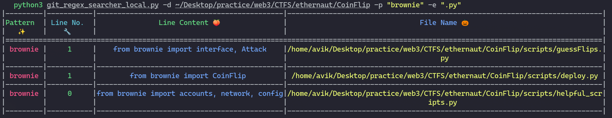

# SearchStorm 🔍🌪️

> Saikat Karmakar | 1 Feb : 2023

---

This script allows you to search for a specific pattern in files recursively. You can specify a directory to search in and the pattern to look for. By default, the script will search for the pattern in all files. You can also specify a file extension to limit the search to a specific file type. The output displays the line number, line content, and file name where the pattern was found.

# Features 🚀
- Search for a pattern in files with a specific file extension.
- Highlight matching pattern in each line.
- Use of concurrent processing for faster search.
- Coloured output to improve readability.
- Escape regex special characters in input pattern for safe search.


# Requirements 💾

- Python 3.7 or higher
- [Termcolor](https://pypi.org/project/termcolor/)
- [Columnar](https://pypi.org/project/columnar/)
- [Click](https://pypi.org/project/click/)

# Installation 🤖
```bash
# using pip
pip install -r requirements.txt
```

## Using pip
**Cooming Soon**

# Usage 🚀
```py
usage: git_regex_searcher_local.py [-h] -d DIRECTORY -p PATTERN [-e EXTENSION]

Search for pattern in files recursively

options:
  -h, --help            show this help message and exit
  -d DIRECTORY, --directory DIRECTORY
                        Directory to search
  -p PATTERN, --pattern PATTERN
                        Pattern to search
  -e EXTENSION, --extension EXTENSION
                        File extension to search (default: all files)

```


```bash
python local_search.py -d /path/to/directory -p pattern [-e file_extension]
```

**Example**:

```bash
python3 git_regex_searcher_local.py -d ~/Desktop/practice/web3/CTFS/ethernaut/CoinFlip -p "brownie" -e ".py"
```




## Import as a Module in other program
```py
#!/usr/bin/python3
import sys
sys.path.append("<path of the repo>")
from SearchStorm import search_files, _print

patterns = ["brownie", "web3"]

def main(directory, ext=".sol"):
	for i in range(len(patterns)):
        #print(patterns[i])
        _print(search_files(directory, patterns[i], ext), patterns[i])

main("~/Desktop/practice/web3/CTFS/ethernaut/CoinFlip", ".py")
```

# Contributing 🤝
Contributions, issues and feature requests are welcome. Feel free to check the [issues page](https://github.com/Aviksaikat/SearchStorm-/issues) if you want to contribute.


# Show your support 💖
Give a ⭐️ if this project helped you!
